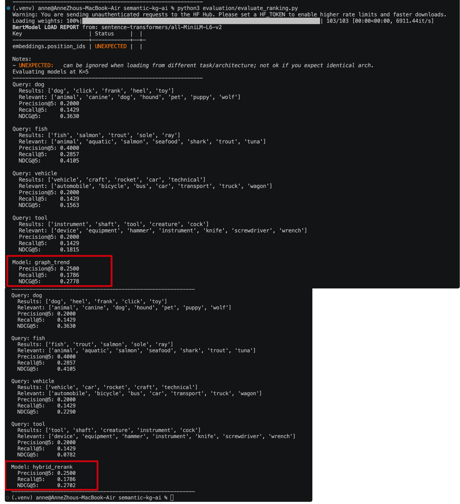
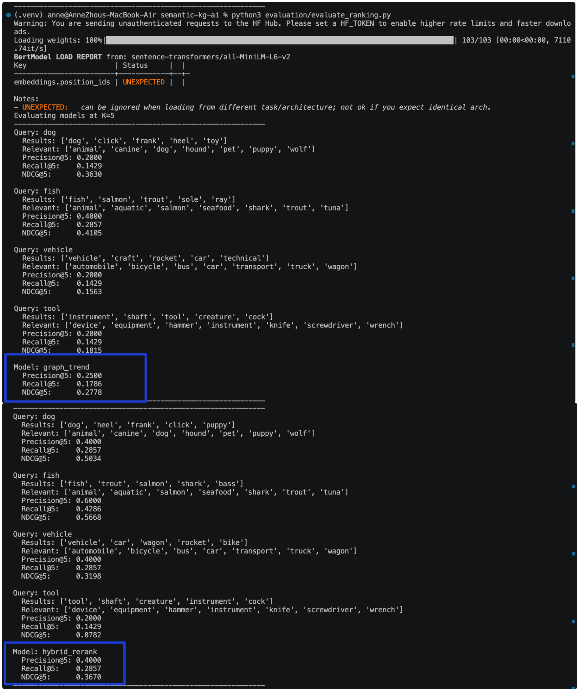
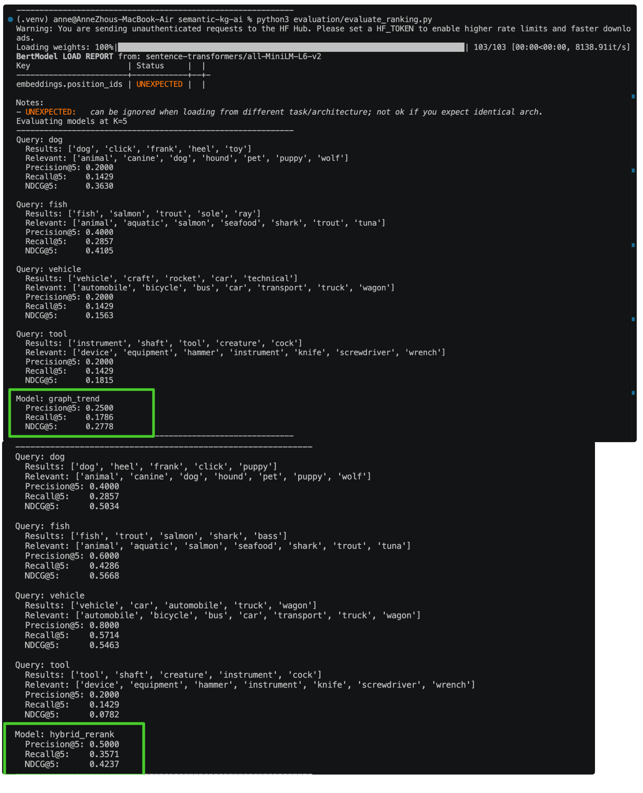
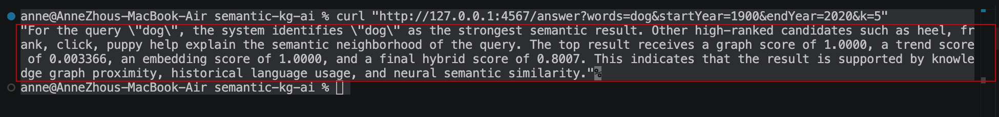

# Hybrid GraphRAG-like Semantic Retrieval and Answer Generation System


==================================================================================

# 1. Overview

This project extends a WordNet-based semantic search system into a hybrid symbolic + neural retrieval-augmented semantic engine that combines knowledge graph reasoning, statistical language signals, neural embeddings, and optional LLM-based answer generation.

The system integrates multiple semantic signals and processing stages:

* WordNet semantic graph traversal
* Query expansion using WordNet synonyms
* BFS-based semantic distance scoring
* Google NGram temporal trend scoring
* Transformer-based embedding similarity (Sentence Transformers)
* Multi-stage hybrid ranking (Top-40 retrieval → Top-5 reranking)
* Retrieval-augmented answer generation 
* Optional external LLM integration
* REST API and interactive web UI
* Quantitative evaluation (Precision, Recall, NDCG)
* Cross-language Java–Python pipeline
* Java → Python → LLM pipeline completed
 
Given a user query, the system expands the query using lexical semantics, retrieves candidate hyponyms from the WordNet knowledge graph, ranks them using graph distance and temporal trends, and applies neural embedding reranking. The top results are then optionally used to generate a natural-language explanation.

This architecture mirrors modern AI retrieval pipelines that combine:

* symbolic knowledge graphs
* statistical language signals
* neural semantic embeddings
* retrieval-augmented generation

to improve semantic relevance, interpretability, and answer quality.

### Optional LLM Integration

The system supports optional external LLM-based answer generation.
The LLM module can be enabled or disabled via command-line arguments.


### What I Implemented

* Built a hybrid symbolic + neural semantic retrieval engine
* Implemented WordNet graph traversal with BFS-based semantic distance scoring
* Added Google NGram temporal trend scoring
* Designed a multi-stage hybrid ranking pipeline (Top-40 → Top-5 reranking)
* Integrated transformer-based embedding similarity for neural reranking
* Implemented cross-language Java ↔ Python retrieval pipeline
* Added explainable scoring (graph, trend, embedding contributions)
* Developed RESTful semantic search API
* Built /answer endpoint for retrieval-augmented explanation generation
* Implemented prompt-based answer generation layer
* Added external LLM integration (toggleable)
* Created evaluation framework with Precision@K, Recall@K, NDCG@K
* Compared baseline vs hybrid retrieval performance
* Built interactive web UI for semantic search visualization
* Deployment configuration for live demo


========================================================

# 2. Architecture

This system implements a multi-stage hybrid symbolic + neural retrieval and answer generation pipeline.

### High-level System Components

- Java backend (Spark) — graph traversal, ranking, and REST API
- Python service — semantic reranking + optional LLM-based explanation
- Frontend (HTML + JS) — interactive query interface

---

### End-to-End Pipeline


```text
User Query
    ↓
Query Expansion (WordNet synonyms)
    ↓
Semantic Graph Retrieval (WordNet hyponyms)
    ↓
BFS Graph Distance Computation
    ↓
Graph Distance Scoring
    ↓
Temporal Trend Scoring (Google NGram)
    ↓
First-stage Hybrid Ranking (graph + trend)
    ↓
Top-40 Candidate Selection
    ↓
Python Semantic Reranking (Sentence Transformers)
    ↓
Embedding Similarity Computation (cosine similarity)
    ↓
Second-stage Hybrid Reranking (graph + trend + embedding)
    ↓
Top-5 Final Candidates
    ↓
Evaluation Module (Precision / Recall / NDCG)
    ↓
Prompt Builder (context construction)
    ↓
┌───────────────────────────────┬────────────────────────────────┐
│ Template Answer Generation    │ External LLM Answer Generation │
│ (deterministic, rule-based)   │ (optional, API-based)          │
└───────────────────────────────┴────────────────────────────────┘
    ↓
Java /answer REST Endpoint
    ↓
Natural Language Explanation Response
    ↓
Web UI / API Output
    ↓
Live Deployment (Docker / Cloud Hosting)

---

### Service Interaction

1. User sends query via frontend  
2. Java backend performs graph retrieval, scoring, and ranking  
3. Java invokes Python service for explanation generation  
4. Python calls an external LLM API  

---

### Deployment Note

In Docker and cloud deployments, the Python service dynamically reads the Java API endpoint via environment variables (`JAVA_API_BASE`), enabling flexible service-to-service communication without hardcoded addresses.


=================================================================

# 3. How the System Works

### Initial Problem -- Problem with Graph-only Retrieval 

Using WordNet graph retrieval alone led to two major issues.

First, explicit graph relations are not the same as semantic relevance.
A candidate may be graph-related without being the most meaningful result for a user query.

Second, graph-based retrieval is vulnerable to polysemy and lexical noise.
For example, the system previously returned:

dog, click, frank, heel, toy

for the query "dog". While these terms are connected in the WordNet graph, they are not intuitive semantic results.This shows that knowledge graph traversal and trend-based ranking alone are insufficient for high-quality semantic search.


### From Symbolic Retrieval to Hybrid Architecture

This project integrates two complementary components:

Symbolic retrieval (WordNet graph) for candidate generation
Neural reranking (transformer embeddings) for semantic ranking

At the system level, this required connecting:

the Java /hyponyms retrieval API
the Python semantic_rerank.py module

This integration enables a full hybrid pipeline where:

the knowledge graph provides candidate recall
the neural model improves semantic relevance


### Why Initial Reranking Did Not Work

After integration, the pipeline initially followed:

retrieve Top-5 → rerank Top-5 → return results

However, embedding-based reranking produced almost no improvement.The experiments revealed that the main problem was not reranking quality, but candidate pool generation quality.

1. Candidate recall was too limited

If only a few candidates are retrieved, the reranker can only perform local optimization on a weak candidate pool.

2. The baseline problem was recall, not just ordering

The graph + trend baseline often failed because high-quality semantic candidates never entered the candidate pool.

3. Neural reranking depends on candidate pool quality


So, this led to a key retrieval insight:

Reranking only works when the recall stage is strong enough.

example: 
If the retrieval stage returns only: dog, click, frank, heel, toy

then, the reranker cannot introduce better candidates such as: puppy, hound, canine, pet

It can only reorder the existing items.




### What Was Tried to Improve the System

To address this, the most important modification was:

expanding the candidate pool from "Top-5 to Top-20, and then to Top-40"
→ rerank → select Top-5

The new pipeline became:

retrieve a larger candidate set from the WordNet graph
rerank that larger set using transformer embeddings
keep only the final Top-5 results

In other words, the system evolved from: retrieve 5 → rerank 5

to: retrieve 20 / 40 → rerank → final top 5

So, this allows the reranker to promote stronger semantic candidates from a larger pool, significantly improving ranking quality.





### Final Pipeline Behavior

The final system combines:

knowledge graph traversal for candidate generation
statistical trend signals for initial ranking
neural embeddings for semantic reranking

This multi-stage design enables both:

high recall (via graph expansion)
high precision (via neural reranking)


============================================================================

# 4. Ranking Strategy

### Graph Distance Scoring --> graphScore


Each candidate word is scored based on its semantic distance in the WordNet graph:

graphScore = 1 / (distance + 1)

Why this works:
The WordNet graph encodes semantic relationships between words.
A smaller BFS distance means the candidate is semantically closer to the query.

The inverse function ensures:

closer nodes → higher score
farther nodes → rapidly decreasing score


###  Temporal Trend Scoring --> trendScore

Each candidate is also scored using its usage frequency from Google NGram:

trendScore = average frequency(startYear, endYear)

Why this works:
Words that are more frequently used in natural language are more likely to be meaningful and relevant.

This signal helps:

reduce rare or noisy words
prefer commonly used semantic concepts

-------------------------------

###  First-stage hybrid ranking（baseline = graph + trend）

Hybrid Ranking（stage 1）
= graph（symbolic） + trend（statistical）
= (symbolic + statistical) hybrid

→ recall candidate selection（Top-40） 


The system combines graph structure and language usage frequency signals:

score = w₁ * graphScore + w₂ * trendScore

Example:

score = 0.7 * graphScore + 0.3 * trendScore

What this score represents:
This is an initial ranking score that balances:

semantic structure (graphScore)
real-world usage frequency(trendScore)

Why this is needed:

graph alone is noisy
trend alone has no semantic structure

combining them improves candidate quality


### Hybrid Ranking Debug


----------------------------------------------

### Second-stage Hybrid Rerank： semantic reranking

Hybrid Rerank（stage 2）
= graph (symbolic ) + trend (statistical) + embedding (neural)
= (symbolic + statistical + neural) hybrid

-> semantic reranking（precision / Top-5）


The system performs a second-stage reranking step using neural semantic similarity to improve the quality of the initial retrieval results.

-> In the first stage, candidate words are retrieved from the WordNet graph and scored using:

* graphScore (semantic distance in the graph)
* trendScore (language usage frequency)

-> In the second stage, a neural similarity signal is introduced:

* embeddingScore (computed using Sentence Transformers and cosine similarity between):

the query embedding
the candidate word embedding


### Final Scoring Function

The final ranking score is computed as a weighted combination of all three signals:

finalScore = w₁ * graphScore 
           + w₂ * trendScore 
           + w₃ * embeddingScore

In practice, the system uses:

finalScore = 0.4 * graphScore + 0.2 * trendScore + 0.4 * embeddingScore


### Score Definitions

* graphScore:  #symbolic
Inverse BFS distance in the WordNet graph
->  captures structural semantic proximity

* trendScore:  #statistical
Normalized Google NGram frequency
-> captures how commonly the word is used

* embeddingScore: #neural
Cosine similarity between sentence embeddings
->  captures true semantic similarity, embedding Score Interpretation

The embeddingScore ranges from 0 to 1:

1.0 → exact semantic match (e.g., dog → dog)
high value → semantically similar (e.g., dog → puppy)
low value → weak or irrelevant relation (e.g., dog → click)
What finalScore Represents

* finalScore:
-> represents the overall relevance of a candidate by combining:

structural similarity (graph)
language usage frequency(trend)
semantic similarity (embedding)

This unified score ensures that top-ranked results are not only connected in the knowledge graph, but also meaningful and semantically aligned with the query.

Example
dog:   graph=1.0000, trend=0.003366, embedding=1.0000, final=0.8007
heel:  graph=1.0000, trend=0.000483, embedding=0.3534, final=0.5415
frank: graph=1.0000, trend=0.000531, embedding=0.3361, final=0.5345
click: graph=1.0000, trend=0.000852, embedding=0.3279, final=0.5313
toy:   graph=0.5000, trend=0.000462, embedding=0.5492, final=0.4198

For example:

“dog” receives a high finalScore because it is both structurally identical and semantically aligned

“heel” has a high graphScore but low embeddingScore, so its finalScore is reduced

* semantic reranking：

The semantic reranking step recomputes a unified finalScore by integrating graph-based, statistical, and neural signals, which is then used to produce the final ranking.

semantic reranking = graph + trend  →  graph + trend + embedding

semantic reranking is a "process". It is not a formula but a process of change:

Phase One: Existing Ranking (graph + trend)
Phase Two: Add embedding → Reorder

Semantic reranking reorders candidates by introducing an additional embedding-based similarity signal on top of the initial graph + trend ranking.Semantic reranking is the process of updating the ranking function by incorporating embedding-based similarity, while finalScore is the resulting unified score used to rank candidates.

The initial graph-based retrieval optimizes recall, while semantic reranking improves precision by introducing neural similarity.


### Why This Works

This reranking step allows the system to combine:

symbolic knowledge graph reasoning (graphScore)
statistical language usage frequency (trendScore)
neural semantic understanding (embeddingScore)

As a result, the system can move beyond graph connectivity and produce semantically meaningful rankings.


=============================================================


# 5. Evaluation 

A small manually labeled evaluation set was created, including:

* a set of semantic queries
* highly_relevant and relevant labels for each query
* ranking metrics:
* Precision@5
* Recall@5
* NDCG@5

The current evaluation pipeline:

* loads queries from queries.json
* loads relevance labels from labeled_relevance.json
* calls the real Java /hyponyms API
* sends candidates to the real Python semantic_rerank.py
* computes ranking metrics on the final results
* Final Results

With the larger Top-40 candidate pool, the real hybrid retrieval pipeline achieved the following:

Model	                     Precision@5	         Recall@5	          NDCG@5
Graph + Trend	                0.25	               0.18	               0.28
Hybrid Rerank (Top-40)	        0.50	               0.36	               0.42

---------------------------------------------------------------
where,

Hybrid reranking is a semantic reranking step where we refine the initial graph-based ranking by incorporating embedding-based similarity, combining symbolic, statistical, and neural signals into a unified scoring function.

Hybrid Rerank ≈ semantic reranking
Hybrid Rerank = a hybrid implementation of semantic reranking
baseline = Graph + Trend


### Compared with the baseline:

Precision@5 improved by 100%
Recall@5 improved by roughly 2×
NDCG@5 improved by roughly 50%

These numbers come from the actual evaluation output of the current system.


Evaluation Scope

This evaluation focuses on retrieval and ranking performance.The external LLM answer generation module is not included in quantitative evaluation, as it involves natural language generation rather than ranking.


### Key Findings

This work led to four main conclusions:

1. Symbolic graph retrieval alone is not enough for high-quality semantic ranking
It works best as a candidate generation mechanism.
2. Embedding reranking is limited when the candidate pool is too small
If relevant candidates never enter the pool, reranking cannot recover them.
3. Expanding the candidate pool allows neural reranking to become effective
This shows that the real bottleneck was recall, not the reranker itself.
4. The most effective design is a multi-stage hybrid retrieval architecture
where the knowledge graph handles recall and neural embeddings handle semantic reranking


### One-Sentence Summary

The main achievement of this section is not simply adding embeddings.
It is the successful integration of the Java knowledge graph retrieval API with the Python neural reranker, followed by the design and evaluation of a multi-stage hybrid semantic retrieval pipeline. By expanding the candidate pool from 5 to 40, the system improved Precision@5 from 0.25 to 0.50, demonstrating the effectiveness of hybrid symbolic + neural retrieval.


==========================================================

# 6. Operating Modes

This allows three operating modes:

### Mode 1 — Retrieval Only

Query → Hybrid Retrieval → Ranked Results

What “Hybrid Retrieval” means here？

In this mode, the system performs:

graphScore + trendScore → hybrid ranking

graphScore captures semantic proximity in the WordNet graph
trendScore captures language usage frequency

So, these signals are combined to produce a ranked list of candidates. This mode performs retrieval（graph + trend）signals only. The system returns ranked semantic candidates without generating natural-language explanations.

The system returns:

* ranked candidate words
* optionally with scoring information

This corresponds to the original /hyponyms API.

Modules involved in this mode:

* Java WordNet semantic retrieval
* BFS-based graph distance scoring
* Google NGram trend scoring
* Weighted hybrid ranking

Modules not used in this mode:

* prompt_builder.py
* llm_answer.py
* external LLM API


### Mode 2 — Retrieval + Template Answer (rule-based)

Query → Retrieval → Rerank → Prompt Builder → Template Answer

Generates rule-based natural language explanations using predefined sentence structures.

where,

Retrieval = graph  + trend → hybrid ranking → candidate pool (top 40)

Rerank: candidate pool (top 40)  → select (top 5) 

Prompt Builder = Convert the data → into input that templates can use
               = Fill in the variables with fixed sentence patterns


### Mode 3 — Retrieval + External LLM Answer

Query → Retrieval → Rerank → Prompt Builder → External LLM → Answer

Prompt Builder = Convert the data → Uses an external LLM to generate explanations grounded in retrieval results.

This design enables flexible experimentation between:

* symbolic retrieval
* neural reranking
* retrieval-augmented generation
* full LLM-based explanation


I designed the system to support three operating modes in order to balance retrieval accuracy, interpretability, cost, and flexibility. 

In Mode 1 (Retrieval Only), the system performs hybrid semantic retrieval and returns ranked candidates with scores, without generating any natural-language explanation. 

In Mode 2 (Retrieval + Template Answer), I added a lightweight explanation layer that generates natural-language responses using predefined templates, where fixed sentence structures are filled with retrieval and scoring signals. This provides stable, deterministic, and cost-free explanations. 

In Mode 3 (Retrieval + External LLM Answer), I integrated an optional LLM-based generation layer that produces dynamic, context-aware explanations based on the retrieved results, enabling more natural phrasing,summarization, and reasoning.

Both Mode 2 and Mode 3 generate natural-language explanations. Mode 2 uses rule-based template generation, while Mode 3 uses an external LLM for dynamic answer generation.

 I intentionally kept both Mode 2 and Mode 3: template-based generation is reliable, controllable, and free to run, while LLM-based generation is more expressive but introduces latency, cost, and potential hallucination. This design reflects real-world AI systems, where a deterministic baseline is maintained and LLMs are optionally enabled for enhanced user experience and reasoning capabilities.

### Mode Selection

The generation mode can be selected via configuration or command-line arguments.

For example:

python3 llm_answer.py dog              # Mode 2 (template)
python3 llm_answer.py dog --use-llm    # Mode 3 (LLM)


### The system functions as a Hybrid Symbolic + Neural Retrieval-Augmented Semantic Search and Answer Generation System.

I built a full end-to-end pipeline that combines:

* knowledge graph reasoning

(WordNet graph traversal with BFS-based semantic distance)


* multi-stage hybrid ranking

(graph + trend for candidate generation, embedding for reranking)


* neural embedding-based reranking

(Sentence Transformers + cosine similarity)


* retrieval-augmented explanation generation

(using retrieved and reranked results to generate grounded explanations via prompt_builder.py and llm_answer.py)


* optional LLM-based answer generation

(supporting both template-based answers and external LLM-generated responses)


* quantitative evaluation

(Precision@K, Recall@K, NDCG@K using real retrieval outputs)


* RESTful API and deployable architecture

(Java server with /hyponyms and /answer endpoints, integrated with Python modules, and deployable via Docker)


This transforms the project from a simple semantic search engine into a production-style hybrid retrieval and generation system aligned with modern GraphRAG-like architectures.


==========================================================================
# 7. System Components

The system is composed of several modular components across Java and Python:


### query expansion

The system performs query expansion using WordNet semantic relations to improve recall during retrieval.

What it does

Expands the input query with semantically related terms
Introduces synonyms and related concepts
Increases the candidate search space before graph retrieval


###  WordNet Graph Retrieval

This component is responsible for retrieving semantically related candidate words from the WordNet knowledge graph.

* Builds a directed semantic graph using WordNet
* Performs BFS traversal to retrieve hyponyms
* Provides candidate generation for downstream ranking

### Example：

For a query like: “dog”

The system traverses the WordNet graph and retrieves semantically related words such as:

dog → animal → mammal → canine → puppy → hound → wolf


These words form the initial candidate pool for ranking.


For the query term "dog", the system will traverse the WordNet graph to find the relevant words, for example:

animal, mammal, canine, puppy, hound, wolf


These words form the candidate set for the subsequent sorting stage.


### Key files：

* WordNet.java

Core Responsibility: Constructing and managing the semantic graph

Loads WordNet data (synsets and hyponyms)
Builds the graph structure
Provides APIs to query semantic relationships

One-line summary: WordNet.java = data source + graph structure management


* Graph.java

Core Responsibility: Graph structure and BFS traversal

Represents the directed graph
Implements BFS traversal
Computes distances between nodes

One-line summary: Graph.java = graph algorithms (BFS + distance computation)


* HyponymsHandler.java 

Core function: API layer entry (converting graphs into results) 
Change "Graph computing" to "API output"

Receives user query from /hyponyms endpoint
Calls WordNet + Graph to retrieve candidates
Formats and returns results

It serves as the recall stage of the system, generating a semantically related candidate pool using BFS traversal over the WordNet graph.


--------------------------------------------------------------------

### Temporal Trend Scoring
* Computes word usage frequency using Google NGram data
* Assigns a trendScore to each candidate

Key files：

NGramMap.java
TrendScorer.java

--------------------------------------------------------------------

### First-stage Hybrid Ranking

* Combines graphScore and trendScore
* Produces an initial ranked candidate set (Top-40)

Key files：

WeightedRanker.java

------------------------------------------------------------------

### Neural Semantic Reranking

* Computes embedding-based semantic similarity
* Reorders candidates using cosine similarity
* Produces final Top-5 results

The semantic vector is calculated through Sentence Transformers and reordered using cosine similarity to obtain the final Top-5 result.

Key files：

* semantic_rerank.py
* embedding_search.py


-> Embedding-based Semantic Similarity：

The system integrates neural semantic similarity using Sentence Transformers.

Candidate terms are encoded into dense vector representations, and semantic similarity is computed using cosine similarity between:

the query embedding
the candidate word embedding

This produces an embeddingScore, which reflects how semantically similar a candidate is to the query.

Example
dog → canine (0.93)
dog → animal (0.81)
dog → puppy (0.80)

This neural signal complements symbolic WordNet-based retrieval by capturing contextual semantic meaning beyond graph structure.


--------------------------------------------------------


### Answer Generation Layer

Converts ranked results into structured prompts
Generates natural-language explanations
Supports both template-based and LLM-based generation

Includes ：

Prompt construction ：
prompt_builder.py
Answer generation：
llm_answer.py


------------------------------------------------------------

### REST API Layer

Exposes system functionality via HTTP endpoints
Integrates Java retrieval with Python reranking and answer generation

Provide system capabilities through the REST API, expose the retrieval and question-answering interfaces externally, and achieve the connection between Java and Python modules.

Endpoints：

/hyponyms → retrieval API（retrieval Interface）
/answer → retrieval + generation API（question-answering interfaces ）

Key files：

Main.java
AnswerHandler.java
NgordnetServer.java


---------------------------------------------------------

### Evaluation Module

Evaluates retrieval performance using Precision, Recall, and NDCG
Compares baseline vs hybrid reranking

Key files：

evaluate_ranking.py
compare_baselines.py
queries.json
labeled_relevance.json


--------------------------------------------------------
### Deployment & Infrastructure

Supports containerized deployment using Docker
Enables full pipeline execution as a service


Key files：

Dockerfile
docker-compose.yml
Procfile


=============================================================


# Live Demo 

---

###  Web API

Example:

```
/hyponyms?words=dog&startYear=1900&endYear=2020&k=5
```

Returns ranked semantic candidates.


## API Result


---

###  Interactive UI

Access:

```
http://127.0.0.1:4567/ngordnet.html
```

## UI Example


---

### Answer Generation API


The system provides an /answer endpoint that returns a natural-language explanation grounded in hybrid retrieval and reranking results.

Example

curl "http://127.0.0.1:4567/answer?words=dog&startYear=1900&endYear=2020&k=5"

What it does

The /answer endpoint executes the full retrieval-to-generation pipeline:

* retrieves candidates from the WordNet graph
* applies hybrid graph + trend ranking
* performs embedding-based semantic reranking
* constructs a retrieval-aware prompt
* generates a natural-language explanation


Output：

Instead of returning only ranked words:

dog, puppy, hound, animal

The system produces a grounded explanation:

For the query "dog", the system identifies "dog" as the strongest semantic result...
Why this matters

This upgrades the system from:

“semantic retrieval engine” to: “retrieval-augmented semantic answering system”




=================================================================


### Trade-offs / Design Decisions


This project involves several key design decisions to balance accuracy, efficiency, interpretability, and system complexity.

### Why BFS instead of GNN?

I chose BFS-based graph traversal instead of Graph Neural Networks (GNNs) for several practical reasons.

First, BFS is lightweight, deterministic, and easy to implement on top of the WordNet graph. It directly captures semantic distance in the graph structure without requiring model training.

Second, the dataset (WordNet) is relatively static and well-structured, making explicit graph traversal both efficient and interpretable.

In contrast, GNNs require significant training data, additional infrastructure, and introduce model complexity and latency. For this project, BFS provides sufficient semantic coverage while keeping the system simple, fast, and explainable.


### Why embeddings only in the second stage?

Embeddings are used only in the second stage (reranking) rather than during initial retrieval.

The first-stage retrieval (graph + trend) is designed to maximize recall by efficiently generating a broad candidate pool. Embedding computation is relatively expensive, so applying it to all possible nodes would significantly increase latency.

By restricting embedding similarity to the Top-K candidates (e.g., Top-40), the system achieves a balance between efficiency and accuracy: the candidate pool is large enough for meaningful semantic reranking, while computation remains tractable.

### Why hybrid ranking instead of graph-only?

Graph-only retrieval is insufficient for capturing true semantic relevance.

While WordNet graph structure provides strong symbolic relationships, it does not always align with real-world semantic similarity. For example, polysemy and lexical ambiguity can introduce noisy candidates that are structurally connected but not semantically relevant.

By combining graphScore (structure), trendScore (language usage), and embeddingScore (semantic similarity), the hybrid ranking approach produces more accurate and robust results.

This design leverages the strengths of symbolic, statistical, and neural signals.


### Why Java + Python split?

The system is intentionally split between Java and Python to leverage the strengths of each ecosystem.

Java is used for the core retrieval pipeline, including WordNet graph traversal, BFS computation, and API serving. It provides strong performance, type safety, and integrates well with the existing Ngordnet infrastructure.

Python is used for embedding-based semantic reranking and answer generation, due to its rich ecosystem of machine learning libraries (e.g., Sentence Transformers).

This separation enables modular development and allows each component to use the most suitable tools, while integration is handled via API calls.

==========================================================


# Project technology

Project Technology

WordNet knowledge graph

Graph traversal with BFS

Query expansion using lexical semantics

Google NGram statistical language data

Hybrid symbolic ranking (graph + trend)

Sentence Transformers (all-MiniLM-L6-v2)

Embedding similarity with cosine distance

Neural + symbolic hybrid retrieval

Multi-stage semantic reranking

Retrieval-augmented answer generation

Prompt-based answer construction

Optional external LLM integration (GraphRAG-style)

Cross-language Java–Python pipeline

RESTful API (Java + Spark)

/answer natural-language explanation endpoint

Evaluation metrics (Precision@K, Recall@K, NDCG)

Baseline vs hybrid ranking comparison

Interactive web UI (HTML / JS)


=========================================================


# Result

This project evolves from a basic WordNet-based search tool into a Hybrid Symbolic + Neural Retrieval-Augmented Semantic Search and Answer Generation System.

The final system integrates:

* knowledge graph reasoning (WordNet + BFS traversal)
* statistical language signals (Google NGram trend scoring)
* neural semantic similarity (Sentence Transformers embeddings)
* multi-stage hybrid ranking (graph + trend → graph + trend + embedding)
* retrieval-augmented explanation generation
* optional LLM-based answer generation layer（LLM is used only for explanation generation, not for retrieval or   ranking.）
* RESTful API for retrieval and answer generation


A key improvement was the introduction of a multi-stage retrieval pipeline with an expanded candidate pool:

Top-5 → Top-40 → rerank → Top-5

This change significantly improved performance:

Precision@5: 0.25 → 0.50
Recall@5: 0.18 → 0.36
NDCG@5: 0.28 → 0.42

These results show that improving recall is critical for effective semantic reranking, and that combining symbolic, statistical, and neural signals leads to more accurate and robust semantic search.

Overall, the system demonstrates a GraphRAG-like architecture, where:

* knowledge graphs provide structured recall
* neural embeddings improve semantic precision
* answer generation layers produce interpretable outputs

=============================================================
# Future Work

* End-to-End Evaluation

Expand evaluation beyond ranking metrics.

evaluate answer quality (human or LLM-based evaluation)
measure latency and system performance
benchmark against modern retrieval systems

* Improved Query Expansion

Enhance query expansion to reduce noise caused by polysemy.

filter irrelevant expansions (e.g., dog → hotdog)
incorporate context-aware expansion strategies
use embedding similarity to refine expanded queries

* Scalable Retrieval Infrastructure

Extend the system to handle larger datasets.

replace WordNet with larger knowledge graphs
integrate vector databases for embedding retrieval
optimize BFS traversal and caching strategies


---
