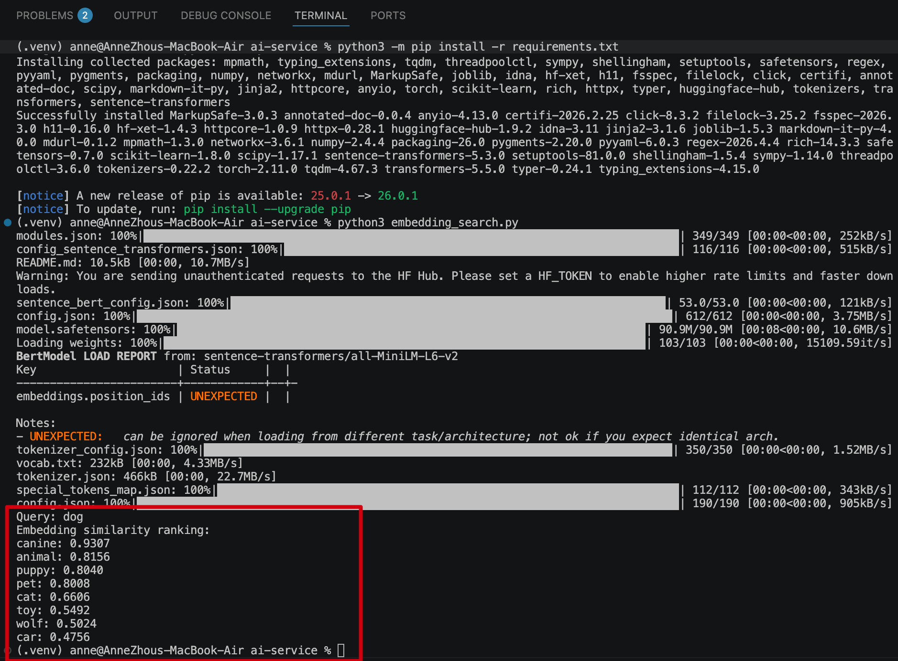
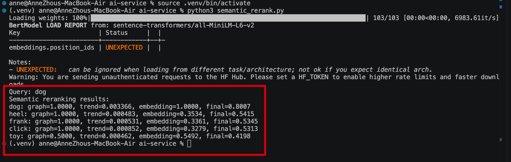

#  Hybrid Symbolic + Neural Semantic Search Engine

## Overview

This project extends a WordNet-based semantic search system into a hybrid symbolic + neural semantic retrieval engine by combining knowledge graph reasoning, statistical language trends, and transformer-based embeddings.

The system integrates multiple semantic signals:

* WordNet semantic graph traversal
* Query expansion using WordNet synonyms
* BFS-based graph distance semantic scoring
* Google NGram temporal trend scoring
* Neural embedding similarity using Sentence Transformers
* Multi-stage weighted hybrid ranking pipeline
* Web-based interactive query interface

Given a user query, the system first expands the query with semantically related terms, retrieves candidate hyponyms from the WordNet knowledge graph, and ranks them using semantic proximity, historical language usage trends, and neural embedding similarity.

This multi-stage retrieval architecture mirrors modern AI search pipelines that combine:

* symbolic knowledge graphs
* statistical language signals
* neural semantic embeddings

to improve semantic relevance and ranking quality.

### What I Implemented

* Built a hybrid semantic retrieval engine combining WordNet graph distance and Google NGram temporal trends
* Implemented bounded query expansion to improve semantic recall
* Added transformer-based sentence embeddings for neural semantic similarity
* Designed a multi-stage hybrid ranking pipeline (graph + trend + embedding) with top-k reranking
* Implemented BFS-based semantic distance computation over a knowledge graph
* Developed a RESTful semantic search API with real-time ranking results
* Built a web-based UI for interactive semantic query exploration
* Added explainable scoring showing graph, trend, and embedding contributions

The system serves as a lightweight AI semantic search prototype bridging knowledge graphs, neural embeddings, and modern retrieval ranking techniques.


---


## Architecture


The system follows a multi-stage hybrid retrieval and ranking pipeline:

```
User Query
    ↓
Query Expansion (WordNet synonyms)
    ↓
Semantic Graph Retrieval (WordNet hyponyms)
    ↓
BFS Graph Distance Computation
    ↓
Graph Distance Scoring
    ↓
Temporal Trend Scoring (Google NGram)
    ↓
First-stage Hybrid Ranking (graph + trend)
    ↓
Top-K Candidate Selection
    ↓
Neural Embedding Similarity (Sentence Transformers)
    ↓
Second-stage Semantic Reranking (graph + trend + embedding)
    ↓
Explainable Scoring Aggregation
    ↓
REST API Response
    ↓
Web UI Visualization
```

### Ranking Formula

First-stage hybrid ranking:

```
score₁ = w₁ * graphScore + w₂ * trendScore
```

Second-stage semantic reranking:

```
finalScore = w₁ * graphScore 
           + w₂ * trendScore 
           + w₃ * embeddingScore
```

Where:

* `graphScore` = inverse BFS distance in WordNet graph
* `trendScore` = normalized Google NGram frequency
* `embeddingScore` = cosine similarity of sentence embeddings
* `w₁, w₂, w₃` = configurable hybrid weights


### Design Characteristics

* Combines symbolic knowledge graphs and neural embeddings
* Multi-stage retrieval + reranking architecture
* Explainable scoring at each ranking stage
* Hybrid statistical + semantic ranking signals
* Modular pipeline for future LLM integration

This architecture mirrors modern semantic search systems used in AI retrieval pipelines.


## Features


* WordNet-based semantic graph retrieval
* Bounded query expansion using WordNet synonyms
* BFS-based semantic graph distance scoring
* Google NGram temporal trend scoring
* Hybrid symbolic ranking (graph + trend)
* Transformer-based embedding semantic similarity
* Second-stage neural semantic reranking
* Top-k candidate selection and reranking
* Explainable scoring (graph / trend / embedding contributions)
* RESTful semantic search API
* Interactive web-based UI for query exploration


### 1. WordNet Graph Retrieval

* Builds a directed semantic graph
* Supports hyponyms lookup
* BFS traversal for descendants

### 2. Graph Distance Scoring

Each candidate word is scored using:

```
graphScore = 1 / (distance + 1)
```

Closer semantic nodes receive higher scores.

---

### 3. Temporal Trend Scoring

Using Google NGram frequency:

```
trendScore = average frequency(startYear, endYear)
```

Words more commonly used in language receive higher scores.

---

### 4. Hybrid Ranking

Final ranking combines both signals:

```
finalScore = 0.7 * graphScore + 0.3 * trendScore
```

This creates a hybrid semantic + statistical ranking system.


## Hybrid Ranking Debug


---

### 5. Web API

Example:

```
/hyponyms?words=dog&startYear=1900&endYear=2020&k=5
```

Returns ranked semantic candidates.


## API Result


---

### 6. Interactive UI

Access:

```
http://127.0.0.1:4567/ngordnet.html
```

## UI Example


---

### 7. query expansion


---
### 8.Embedding-based Semantic Similarity

The system integrates neural semantic similarity using Sentence Transformers.

Candidate terms are encoded into dense embeddings and ranked using cosine similarity.

Example:

dog → canine (0.93)
dog → animal (0.81)
dog → puppy (0.80)

This neural ranking complements symbolic WordNet-based retrieval.




---

### 9. Semantic Reranking

The system performs a second-stage semantic reranking step using neural sentence embeddings.

Candidate words are first retrieved from the WordNet graph and scored with:

* graph distance score
* temporal trend score

Then a neural semantic similarity score is computed using Sentence Transformers and cosine similarity.

The final reranking score is computed as:

```text
finalScore = 0.4 * graphScore + 0.2 * trendScore + 0.4 * embeddingScore
```

Example output:

```text
dog:   graph=1.0000, trend=0.003366, embedding=1.0000, final=0.8007
heel:  graph=1.0000, trend=0.000483, embedding=0.3534, final=0.5415
frank: graph=1.0000, trend=0.000531, embedding=0.3361, final=0.5345
click: graph=1.0000, trend=0.000852, embedding=0.3279, final=0.5313
toy:   graph=0.5000, trend=0.000462, embedding=0.5492, final=0.4198
```

This allows the system to combine symbolic knowledge graph reasoning with neural semantic similarity.





------

# Project technology

* WordNet knowledge graph
* Graph traversal with BFS
* Query expansion using lexical semantics
* Google NGram statistical language data
* Hybrid symbolic ranking (graph + trend)
* Sentence Transformers (all-MiniLM-L6-v2)
* Embedding similarity with cosine distance
* Neural + symbolic hybrid retrieval
* Multi-stage semantic reranking
* RESTful API (Java + Spark)
* Interactive web UI (HTML / JS)


---

## Completed AI Retrieval Features

The system currently implements the following capabilities:

* WordNet-based semantic graph retrieval
* Query expansion using WordNet synonyms
* BFS-based semantic graph distance scoring
* Google NGram temporal trend scoring
* Hybrid symbolic ranking (graph + trend)
* Transformer-based embedding semantic similarity
* Second-stage neural semantic reranking
* Top-k candidate selection and reranking
* Explainable scoring (graph / trend / embedding contributions)
* RESTful semantic search API
* Web-based interactive UI for query visualization

This results in a Hybrid Symbolic + Neural Semantic Search Engine combining knowledge graphs, statistical signals, and transformer embeddings.


----
## Future Work

* LLM integration

---
