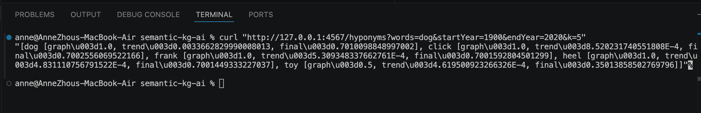
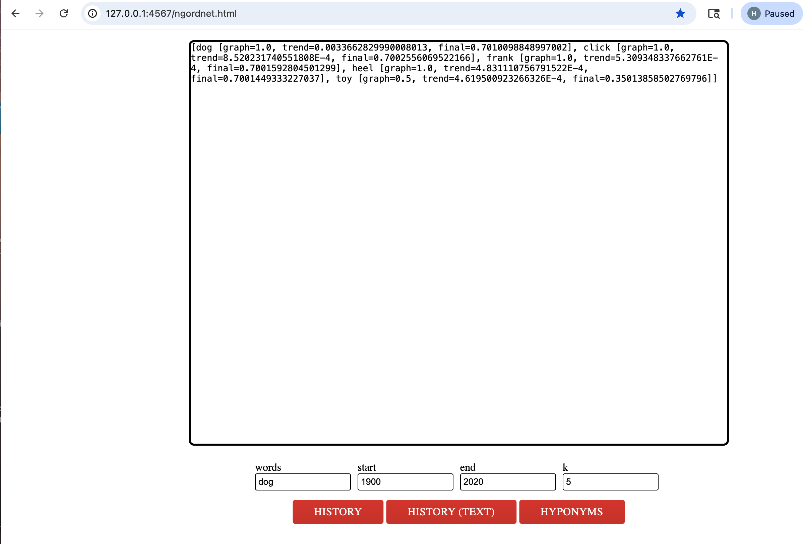
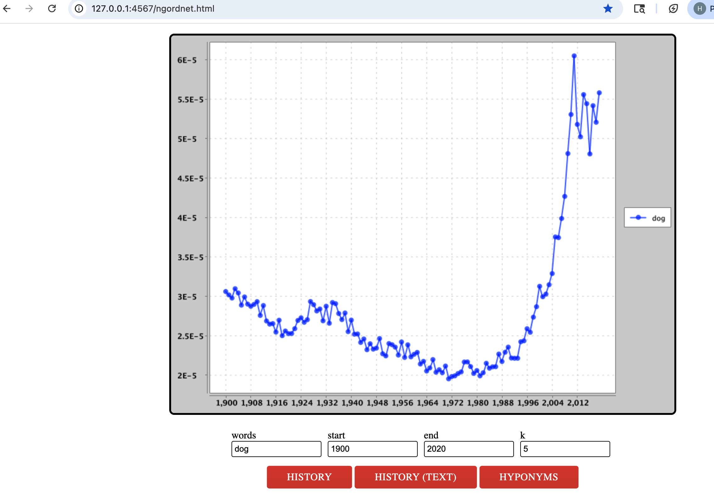
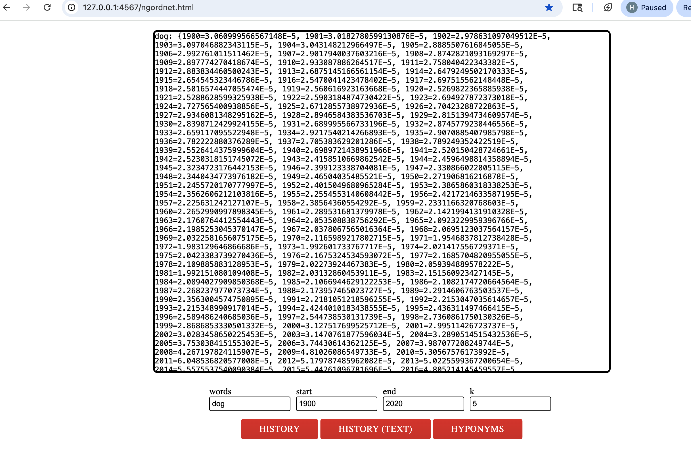
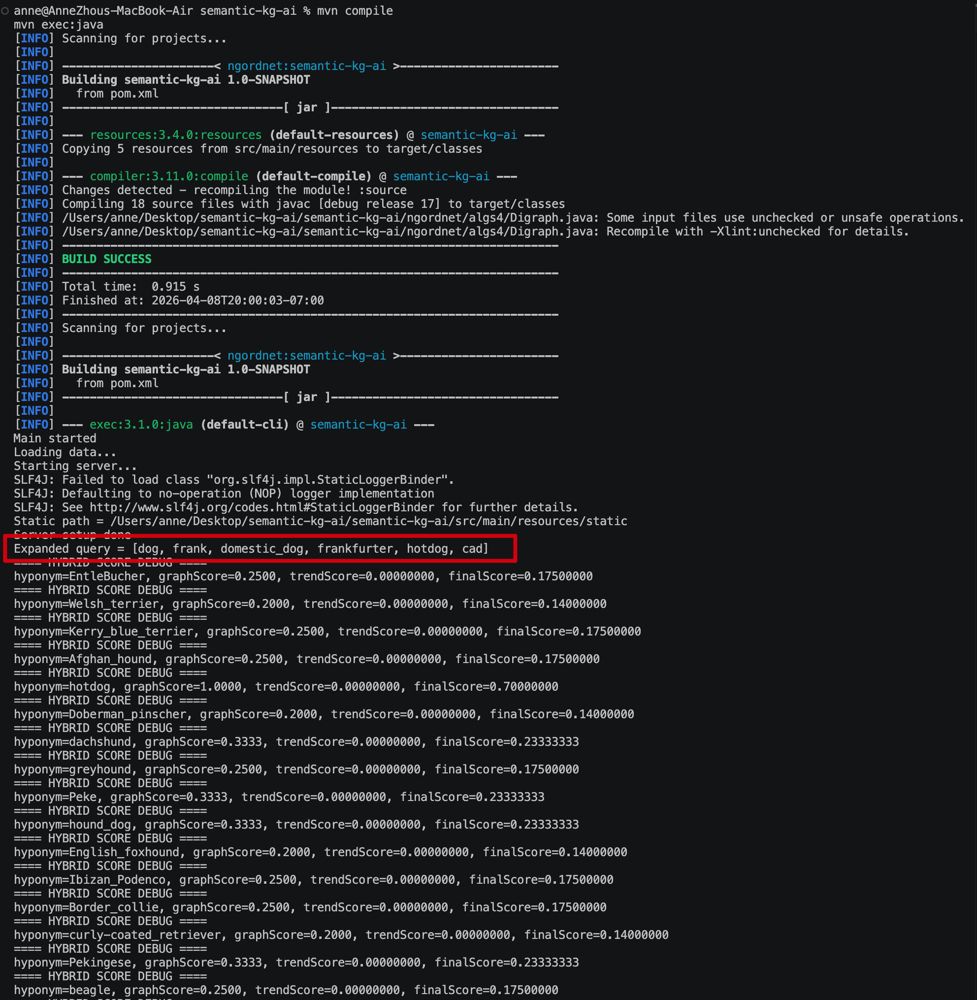
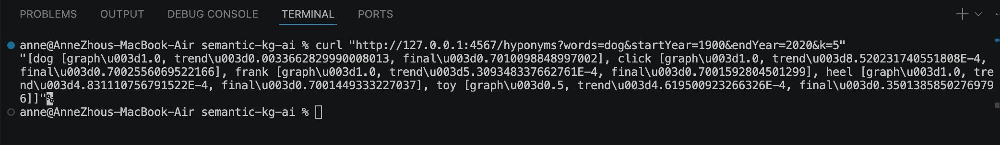

# Semantic KG AI — Hybrid Semantic Ranking

## Overview

This project extends a WordNet-based semantic search system into a **hybrid semantic retrieval and ranking engine** by combining:

* WordNet semantic graph traversal
* Query expansion using WordNet synonyms
* Graph-distance semantic scoring (BFS-based)
* Google NGram temporal trend scoring
* Weighted hybrid ranking pipeline
* Web-based interactive query interface

The system first expands user queries with semantically related terms, retrieves candidate hyponyms from the WordNet graph, and ranks them using both **semantic proximity** and **historical language usage trends**.

This architecture mirrors modern AI retrieval pipelines that combine **symbolic knowledge graphs** with **statistical language signals** for improved semantic relevance.

Key contributions:

* Built a hybrid semantic ranking engine combining WordNet graph distance and Google NGram temporal trends
* Implemented bounded query expansion to improve semantic recall
* Designed weighted hybrid scoring (graph + trend) with top-k reranking
* Implemented BFS-based semantic distance computation on a knowledge graph
* Developed a web-based semantic search interface with REST API and real-time ranked retrieval

The system serves as a lightweight semantic search prototype bridging knowledge graphs and AI-style retrieval ranking.


---
## Architecture

User Query
↓
Query Expansion (WordNet synonyms)
↓
Hyponym Retrieval (WordNet graph)
↓
Graph Distance Scoring
↓
Temporal Trend Scoring (Google NGram)
↓
Weighted Hybrid Ranking
↓
Top-K Semantic Results


## Features

* WordNet-based semantic graph retrieval
* Bounded query expansion using synonyms
* BFS-based graph distance scoring
* Google NGram temporal trend scoring
* Weighted hybrid ranking
* REST-style API and interactive web UI
* Debuggable ranking output with graph / trend / final scores


### 1. WordNet Graph Retrieval

* Builds a directed semantic graph
* Supports hyponyms lookup
* BFS traversal for descendants

### 2. Graph Distance Scoring

Each candidate word is scored using:

```
graphScore = 1 / (distance + 1)
```

Closer semantic nodes receive higher scores.

---

### 3. Temporal Trend Scoring

Using Google NGram frequency:

```
trendScore = average frequency(startYear, endYear)
```

Words more commonly used in language receive higher scores.

---

### 4. Hybrid Ranking

Final ranking combines both signals:

```
finalScore = 0.7 * graphScore + 0.3 * trendScore
```

This creates a **hybrid semantic + statistical ranking system**.


## Hybrid Ranking Debug


---

### 5. Web API

Example:

```
/hyponyms?words=dog&startYear=1900&endYear=2020&k=5
```

Returns ranked semantic candidates.


## API Result




---

### 6. Interactive UI

Access:

```
http://127.0.0.1:4567/ngordnet.html
```

## UI Example








---

### 7. query expansion






---

## Example Output

```
dog [graph=1.0, trend=0.0033, final=0.7010]
click [graph=1.0, trend=0.0008, final=0.7002]
toy [graph=0.5, trend=0.0004, final=0.3501]
```

---

# The AI functions that have been completed now

Semantic graph retrieval
Graph distance scoring
Trend-based statistical scoring
Hybrid ranking
Top-k reranking
Explainable scoring
Web API
UI interface


## Tech Stack

* Java
* Maven
* Spark Java Web Server
* WordNet Dataset
* Google NGram Dataset

---

## Future Work

* Embedding similarity
* Semantic reranking
* LLM integration

---
